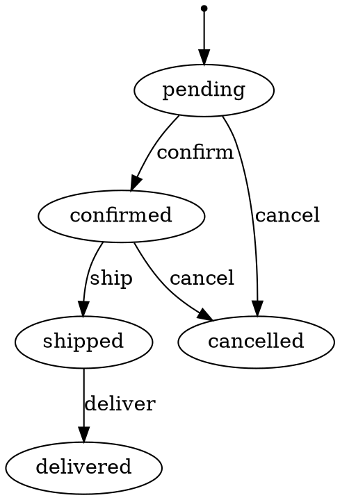

# fsm

A type-safe, declarative, concurrent-safe finite state machine library for Go.

```bash
go get github.com/9edang/fsm
```

> Requires Go 1.21+. Zero external dependencies.

---

## Design Principles

| Principle         | Meaning                                                             |
| ----------------- | ------------------------------------------------------------------- |
| **Type-safe**     | `State` and `Event` are distinct named types — a plain `string` variable is rejected at compile time |
| **Declarative**   | Schema is defined once with a fluent Builder, then frozen at Build  |
| **Zero-magic**    | No reflection, no global registry, no hidden goroutines             |
| **Testable**      | Guards and actions receive `context.Context`; errors are typed      |
| **Concurrent-safe** | Every exported method is protected by `sync.RWMutex` by default   |

---

## Quick Start

Untyped string literals work everywhere. For larger projects, define typed constants once:

```go
type OrderState = fsm.State
type OrderEvent = fsm.Event

const (
    Pending   OrderState = "pending"
    Confirmed OrderState = "confirmed"
    Shipped   OrderState = "shipped"
    Cancelled OrderState = "cancelled"
)
```

Minimal example using inline literals:

```go
package main

import (
    "context"
    "fmt"
    "github.com/9edang/fsm"
)

func main() {
    m, err := fsm.New("pending").
        On("confirm").From("pending").To("confirmed").
        On("ship").From("confirmed").To("shipped").
        On("cancel").From("pending", "confirmed").To("cancelled").
        Build()
    if err != nil {
        panic(err)
    }

    ctx := context.Background()

    fmt.Println(m.Current())       // pending
    fmt.Println(m.Can("confirm"))  // true
    fmt.Println(m.Can("ship"))     // false

    if err := m.Trigger(ctx, "confirm"); err != nil {
        panic(err)
    }
    fmt.Println(m.Current()) // confirmed
}
```

---

## Full Example — Order Lifecycle

```go
package main

import (
    "context"
    "errors"
    "fmt"
    "log"
    "github.com/9edang/fsm"
)

var errPaymentRequired = errors.New("payment not received")

func buildOrderFSM() (*fsm.FSM, error) {
    return fsm.New("pending").
        // Transitions
        On("confirm").From("pending").To("confirmed").
            Guard(func(ctx context.Context) error {
                paid := ctx.Value("paid").(bool)
                if !paid {
                    return errPaymentRequired
                }
                return nil
            }).
            Action(func(ctx context.Context) error {
                fmt.Println("sending confirmation email…")
                return nil
            }).
        On("ship").From("confirmed").To("shipped").
        On("deliver").From("shipped").To("delivered").
        On("cancel").From("pending", "confirmed").To("cancelled").
        // Global hooks
        BeforeTransition(func(ctx context.Context, from, to fsm.State, event fsm.Event) {
            fmt.Printf("[hook] before: %s --%s--> %s\n", from, event, to)
        }).
        AfterTransition(func(ctx context.Context, from, to fsm.State, event fsm.Event) {
            fmt.Printf("[hook] after: %s --%s--> %s\n", from, event, to)
        }).
        OnError(func(ctx context.Context, err error) {
            log.Printf("[hook] error: %v", err)
        }).
        // Per-state hooks
        OnEnter("shipped", func(ctx context.Context) {
            fmt.Println("[hook] order shipped — notify warehouse")
        }).
        OnExit("pending", func(ctx context.Context) {
            fmt.Println("[hook] leaving pending state")
        }).
        // Audit trail
        WithHistory().
        Build()
}

func main() {
    m, err := buildOrderFSM()
    if err != nil {
        panic(err)
    }

    ctx := context.WithValue(context.Background(), "paid", true)

    _ = m.Trigger(ctx, "confirm")
    _ = m.Trigger(ctx, "ship")
    _ = m.Trigger(ctx, "deliver")

    for _, e := range m.History() {
        fmt.Printf("%s  %s --%s--> %s\n", e.At.Format("15:04:05"), e.From, e.Event, e.To)
    }
}
```

---

## API Reference

### Builder

```go
fsm.New(initial State) *Builder
```

Starts a new definition with the given initial state.

```go
b.On(event Event) *TransitionBuilder
b.BeforeTransition(fn TransitionHookFunc) *Builder
b.AfterTransition(fn TransitionHookFunc) *Builder
b.OnError(fn ErrorHookFunc) *Builder
b.OnEnter(state State, fn StateHookFunc) *Builder
b.OnExit(state State, fn StateHookFunc) *Builder
b.WithHistory() *Builder
b.Build() (*FSM, error)
```

### TransitionBuilder

Returned by `Builder.On` or `TransitionBuilder.On`.

```go
tb.From(states ...State) *TransitionBuilder   // one or more source states
tb.To(state State)        *TransitionBuilder   // target state
tb.Guard(fn GuardFunc)    *TransitionBuilder   // add a guard
tb.Action(fn ActionFunc)  *TransitionBuilder   // add an action
tb.On(event Event)        *TransitionBuilder   // start the next transition
tb.Build()                (*FSM, error)        // alias for Builder.Build
// All Builder hook methods are also available on TransitionBuilder,
// returning *Builder so the chain continues naturally.
```

### FSM runtime

```go
m.Current() State            // current state (read-lock)
m.Can(event Event) bool      // can the event fire now? (read-lock)
m.Transitions() []Event      // events valid in the current state (read-lock)
m.Trigger(ctx, event) error  // fire an event (write-lock)
m.History() []HistoryEntry   // audit trail snapshot; nil if WithHistory not called
m.ToMermaid() string         // Mermaid stateDiagram-v2 string
m.ToDOT() string             // Graphviz DOT string
```

### Persistence

```go
fsm.NewWithState(template *FSM, savedState State) *FSM
```

Creates a new runtime using an existing FSM as the schema source and a state loaded from storage. Typical usage:

```go
// At startup — build the template once.
template, _ := buildOrderFSM()

// Per request — restore from DB.
m := fsm.NewWithState(template, stateFromDB)
if err := m.Trigger(ctx, "ship"); err != nil {
    return err
}
saveStateToDB(m.Current())
```

---

## Hook Function Signatures

```go
type TransitionHookFunc func(ctx context.Context, from, to State, event Event)
type StateHookFunc      func(ctx context.Context)
type ErrorHookFunc      func(ctx context.Context, err error)
type GuardFunc          func(ctx context.Context) error
type ActionFunc         func(ctx context.Context) error
```

---

## Trigger Execution Order

When `Trigger` is called, steps execute in this exact order:

```md
1. Validate transition exists for (current state, event)
2. BeforeTransition hooks
3. OnExit hooks for source state
4. Guards (all must pass; first failure aborts — state unchanged)
5. State changes to target
6. Actions (run in order; errors do not roll back state)
7. OnEnter hooks for target state
8. AfterTransition hooks
9. History entry recorded (if WithHistory is enabled)
```

> **Note:** If a guard fails, `BeforeTransition` and `OnExit` have already run. If an action fails, the state has already changed.

---

## Error Types

All errors support `errors.As` and `errors.Is`.

### `*ErrInvalidTransition`

The event is known but the current state has no matching transition.

```go
var e *fsm.ErrInvalidTransition
if errors.As(err, &e) {
    fmt.Println(e.From, e.Event)
}
```

### `*ErrGuardFailed`

A guard rejected the transition. The original guard error is accessible via `errors.Unwrap`.

```go
var e *fsm.ErrGuardFailed
if errors.As(err, &e) {
    fmt.Println(e.Cause) // original guard error
}
```

### `*ErrUnknownEvent`

The event was never registered in the FSM.

```go
var e *fsm.ErrUnknownEvent
if errors.As(err, &e) {
    fmt.Println(e.Event)
}
```

---

## Visualization

### Mermaid

```go
fmt.Println(m.ToMermaid())
```

```bash
stateDiagram-v2
    [*] --> pending
    pending --> confirmed : confirm
    confirmed --> shipped : ship
    shipped --> delivered : deliver
    pending --> cancelled : cancel
    confirmed --> cancelled : cancel
```

Paste the output into any Markdown renderer that supports Mermaid (GitHub, GitLab, Obsidian, etc.).

### Graphviz DOT

```go
fmt.Println(m.ToDOT())
```



Render with `dot -Tpng fsm.dot -o fsm.png` or paste into [Graphviz Online](https://dreampuf.github.io/GraphvizOnline/).

---

## Test Report

Run with `go test -v ./...` on Go 1.23.0 · linux/amd64 · Intel Core i5-1334U.

**63 tests · 0 failures · 100% coverage**

Verified clean with `go test -race ./...`.

---

## Benchmarks

Run with `go test -bench=. -benchmem -benchtime=3s ./...` on Go 1.23.0 · linux/amd64 · Intel Core i5-1334U.

```bash
goos: linux
goarch: amd64
pkg: github.com/9edang/fsm
cpu: 13th Gen Intel(R) Core(TM) i5-1334U
BenchmarkTrigger_HotPath-12                  21164337     156.2 ns/op    64 B/op    1 allocs/op
BenchmarkTrigger_WithGuardAndAction-12       23318056     152.6 ns/op    64 B/op    1 allocs/op
BenchmarkTrigger_WithHooks-12               19990898     168.7 ns/op    64 B/op    1 allocs/op
BenchmarkTrigger_Parallel-12                45491026      69.97 ns/op   64 B/op    1 allocs/op
BenchmarkCan-12                            113263990      29.23 ns/op    0 B/op    0 allocs/op
```

| Benchmark | ns/op | B/op | allocs/op | Notes |
|---|---|---|---|---|
| `Trigger` hot path | 156 | 64 | 1 | No guards, actions, or hooks |
| `Trigger` + guard + action | 153 | 64 | 1 | One no-op guard + one no-op action |
| `Trigger` + all hooks | 169 | 64 | 1 | Before/After/OnEnter/OnExit all registered |
| `Trigger` parallel (12 CPU) | 70 | 64 | 1 | Each goroutine owns its FSM instance |
| `Can` (read-only) | 29 | 0 | 0 | Zero allocations |

The single allocation per `Trigger` comes from `NewWithState` allocating the FSM struct on the heap. The `Trigger` execution path itself is allocation-free.

---

## Caveats

- **Guards and actions must not call back into the same FSM instance.** They execute while the write lock is held; a reentrant call will deadlock.
- **Action errors do not roll back state.** The state has already changed when actions run. If rollback is required, handle it in the action itself or in the `OnError` hook.
- **`NewWithState` allows arbitrary saved states.** An unrecognised state will surface as `ErrInvalidTransition` on the first `Trigger` — it is not validated at construction time.
- **`History()` returns a copy.** Mutating the returned slice has no effect on the FSM.

---

## License

MIT
